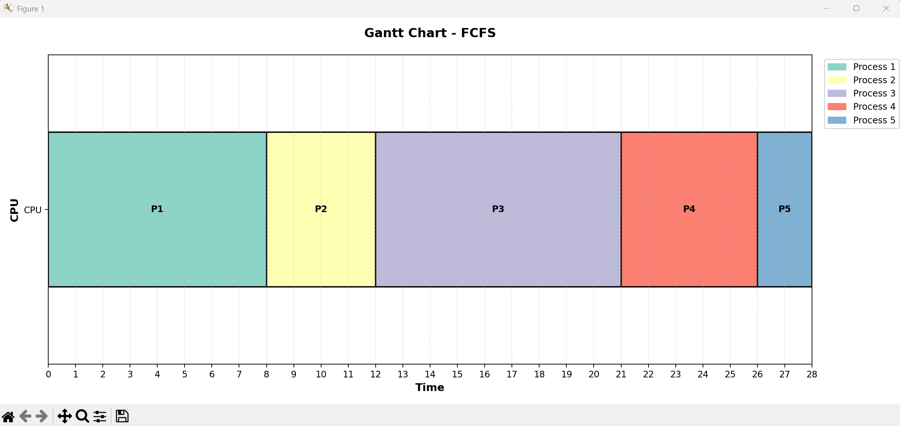

# Advanced CPU Scheduling Simulator (Python)

A comprehensive Python-based simulation of Central Processing Unit (CPU) scheduling algorithms designed to analyze process execution and system performance metrics.

## Technical Implementation

This project implements fundamental Operating Systems concepts through a modular, Object-Oriented approach. It calculates critical metrics including Completion Time, Turnaround Time (TAT), and Waiting Time (WT).

### Core Algorithms Supported
* **First Come First Serve (FCFS):** A non-preemptive model executing processes in arrival order.
* **Shortest Job First (SJF):** Optimized for minimal average waiting time by selecting the shortest burst duration.
* **Priority Scheduling:** Execution based on numerical priority weights.
* **Round Robin (RR):** A preemptive time-sharing implementation with a configurable time quantum.

## Engineering Highlights
* [cite_start]**Data Architecture:** Utilizes Python `dataclasses` for robust process state management, tracking remaining time and arrival synchronization.
* **Visualization:** Integrated with `matplotlib` to generate color-coded Gantt charts, providing a visual timeline of CPU activity.
* [cite_start]**Preemptive Logic:** The Round Robin engine handles context switching by maintaining a dynamic ready queue and managing process re-insertion based on remaining burst cycles.

## How to Run
1. Install dependencies: `pip install -r requirements.txt`
2. Run interactive mode: `python cpu_scheduler.py`
3. Run automated demo: `python demo_scheduler.py`
